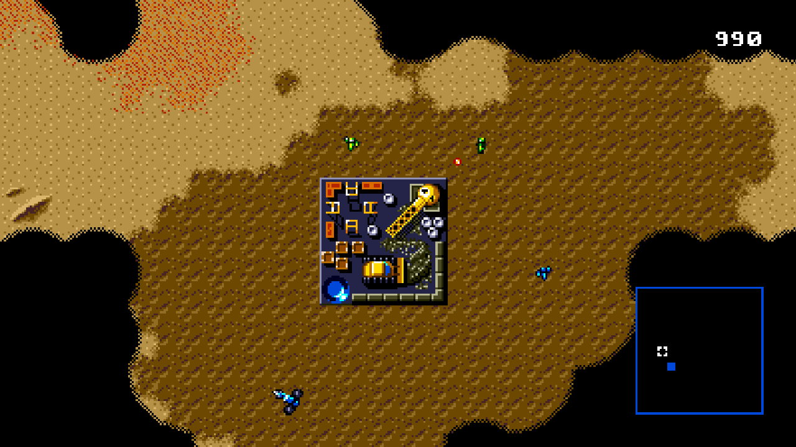
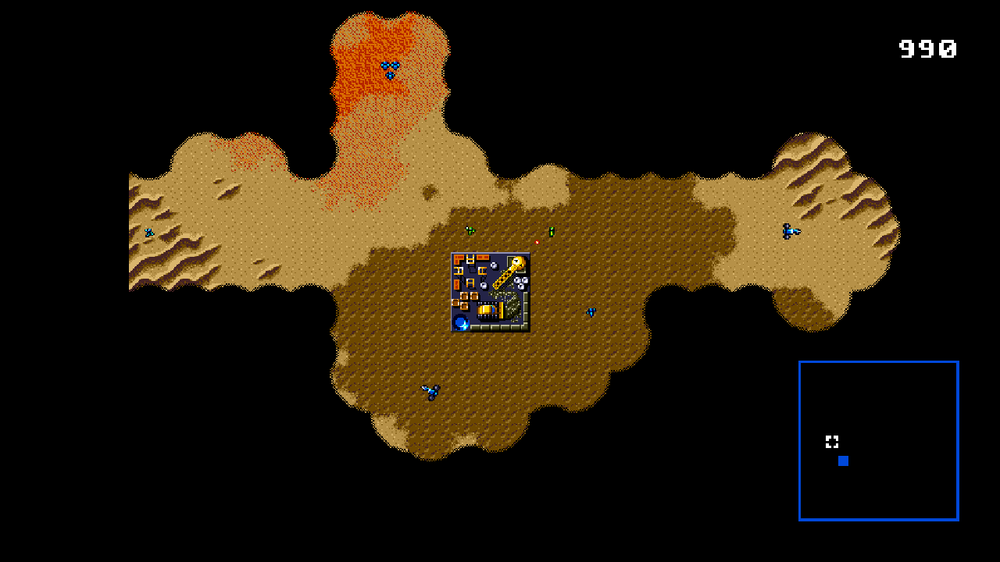

# ReArrakis

[Русский README](README.ru.md) · [Build and controls](docs/usage.md) · [Status](docs/status.md) · [Contributing](CONTRIBUTING.md)

ReArrakis translates the original 68000 and Z80 code into C ahead of time, then builds a native executable. Original game logic runs alongside a runtime for the console hardware. The expanded map uses the game's terrain data and sprite routines.

This is a work in progress. Native builds are available on Linux and macOS (Apple Silicon tested). The first Atreides mission has been exercised through victory in the source project; the full campaign is not yet verified.

## Features

- SDL2 window with a map that adapts to its size and aspect ratio.
- Mouse selection, unit orders, building placement and native production menus.
- Mouse controls for the title screen, house selection and confirmation dialogs.
- Map zoom from 50% to 100%, edge scrolling and minimap navigation.
- Original HUD over the expanded map, and F11 fullscreen.
- YM2612 and PSG sound through the statically translated Z80 driver and ymfm.

## Screenshots

The same first-mission scene at 1280 × 720. Black areas are unexplored terrain.

**Widescreen — 100% scale**



**Widescreen — 50% scale (zoomed out)**



## Build and run

You need your own raw, unswapped **USA ROM**, exactly 1,048,576 bytes. The builder verifies the revision in [profiles/dune-us.json](profiles/dune-us.json):

```text
b1bbe73186e0902fa8b2db0f227bf306e3d6a80fe592f927d1aa9d60c0f335ba
```

Ubuntu / Debian:

```sh
sudo apt install git python3 build-essential pkg-config libsdl2-dev
git clone https://github.com/kruzeman/ReArrakis.git
cd ReArrakis
python3 tools/build_dune.py '/path/to/Dune - The Battle for Arrakis (U) [!].gen'
./run-dune.sh
```

For macOS dependencies and Finder launch, see the [macOS instructions](docs/usage.md#macos).

Sound, mouse controls, adaptive rendering and zoom are enabled automatically. Compilation may take several minutes. The result is `build/dune`, with your ROM data embedded.

Left click selects or confirms; right click orders or cancels. Move the pointer to a window edge to scroll. Use the wheel to zoom, **0** to reset zoom, and **F11** for fullscreen, and **F3** for estimated 68000 occupancy. Keyboard: arrows, **Z / X / C** for A / B / C, **Enter** for Start.

See the [manual](docs/usage.md) for detailed controls, volume and diagnostics, and [status](docs/status.md) for current limitations.

## Development

```sh
make test
make demo
```

These checks use synthetic data and do not require a game ROM. Game-specific checks in `tools/` require a locally generated `build/dune.c`.

Extracted from the Dune branch of [GenesisRecomp](https://github.com/kruzeman/GenesisRecomp), using the shared engine developed for [RROP](https://github.com/kruzeman/RROP). See [architecture](docs/architecture.md) and [provenance](docs/provenance.md).

## Support

[](https://ko-fi.com/O6R42871XC)

If you enjoy the project, you can buy the author a coffee. Bug reports, testing and contributions are welcome too.

## License

Project code: [MIT](LICENSE). Vendored ymfm: BSD 3-Clause; see [third-party notices](THIRD_PARTY_NOTICES.md).

The original game and its assets are not covered by these licenses. No ROM, extracted game assets, generated game code or game executable is included. ReArrakis is an independent fan project, not affiliated with the original developers or rights holders.

The F3 debug overlay also shows `SPD: …%`: virtual console time versus
wall-clock time, sampled over at least half a second. Around 100% means
real-time console speed; 50% means half speed. It measures console timing,
not the frequency of game logic updates or unique rendered frames. Original
game-logic slowdowns can still happen at 100%. Paused/stopped displays `--%`.

Debug branch CPU experiment: the executable starts with 2x 68000 throughput.
F4 switches between 1x and 2x; F3 shows the current multiplier (68K: 1/2).
CPU cycles advance peripheral master time by half as much at 2x; VDP, Z80
and audio keep their stock clocks. This changes original CPU timing and can
affect CPU-bound gameplay. SPD remains console wall-clock speed, not CPU
multiplier. This experiment does not belong to main's faithful defaults.

Mouse support now covers native options and the password keyboard: hover
selects a row/cell; left click activates it. On option values, clicking the
left half cycles backwards and the right half forwards. Click keyboard
letters, `<`/`>` and `!` using their original behavior. Right click closes
options/password entry; in the options confirmation dialog, left click
accepts and right click declines. Settings are changed by native handlers.
